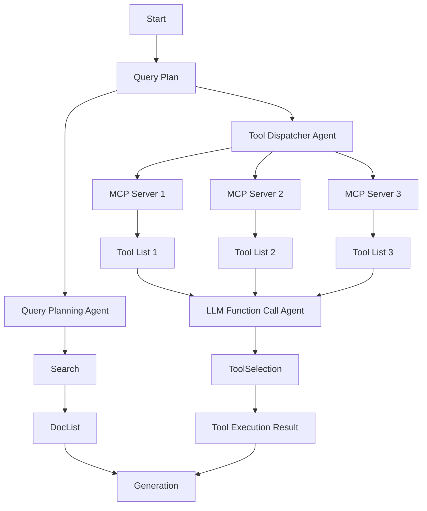

## Open MCP Marketplace | AI Agent Marketplace Index | MCP Client | AI Search from DeepNLP

[](http://deepnlp.org/store/mcp-server/mcp-server/pub-ai-agent-marketplace-index/ai-agent-marketplace-index) |
[](http://deepnlp.org/store/mcp-server/mcp-server/pub-ai-agent-marketplace-index/ai-agent-marketplace-index) |
[WeChat](https://raw.githubusercontent.com/AI-Agent-Hub/mcp-marketplace/refs/heads/main/docs/mcp_marketplace_wechat_group.png)


## Basic

Open MCP Marketplace is an open source project aims to make MCP and AI Agent integration **Easier**.

- You can get well-cleaned up MCP Servers Tools Meta information, Tools and Config Schema, etc. 
- You can integrate a MCP Marketplace (web based client) button or a panel to your AI Apps (Chatbot, AI Search/Deep Research Engine, Video/Image generation, Coding IDE, etc.). So that users can choose their preferred MCP tools (such as Map, Browser Use, Payment, Fetch, etc) to answer their questions.
- Python/TypeScript Support


**Example: Route Planning using Google Map MCP**

Visit [MCP Tool Use App](https://github.com/AI-Agent-Hub/mcp-marketplace/tree/main/app/mcp_tool_use)


**Example: MCP Admin and Playground To Manage Tools and Servers**

Visit [MCP Tool Use App](https://github.com/AI-Agent-Hub/mcp-marketplace/tree/main/app/mcp_tool_use)


**Example: Demo AI Search**

Visit [MCP Tool Use App](https://github.com/AI-Agent-Hub/mcp-marketplace/tree/main/app/ai_search)


**KEY Features**


1. MCP Server Public Index of Tools Schema and Config file
Dataset Collection of MCP Servers Tool/Function Call Schemas from 5000+ MCP servers, Useful for Tools RAG, Tools Dispatcher research and R&D. You can search route planning or "map" keywords from raw schema files. Welcome to add your config to the index. [MCP Tool Schema](./tools/README.md)


2. MCP Marketplace Web Integration, See Web Demo and Video how to integrate the Open MCP Marketplace to Your AI Search Engine or Agent Workflow.

- **Pure Web-based Plugin** : Show the Panel of MCP Tools from available open MCP marketplace, Support Filtering, Search, Installation  <br>
- **Browse Navigate and Pagination** : User can browser the MCP Tools by category and use pagination to navigate. <br>
- **Customized MCP servers Selection and Installation** : Users can choose which MCP tools to perform tasks from mcp tools marketplace with similar features, such as Map Location, Search, Fetch, Payment, etc.  <br>
- **Badge**: Put Badge on your homepage Track MCP Servers User Reviews and Ratings, such as 


3. Various API Endpoint Support for Your AI Client Development

- **Various MCP Marketplace API Endpoint**: Get Server Schema, Such as [pulsemcp.com](http://www.pulsemcp.com), [deepnlp.org](http://www.deepnlp.org), [aiagenta2z.com](http://www.aiagenta2z.com),etc. <br>
- **GET/UPDATE/CREATE** MCP Servers Meta information to get your MCP Server more visibilityy. <br>
- **Python and Typescript SDK** Search and registry of MCP Servers and Tools <br>
- **Rich Meta Data** Tools, Servers Description, URL, Category, Github stars, User reviews score, Ratings and more statistics. <br>


4. Agent Workflow of MCP Marketplace
- [**MCP Tools Dispatcher Agent**](#tool_dispatcher): The MCP Tool Dispatcher Agent helps to retrieve relevent tools from thousands of MCP servers and tools from marketplace, and reduce the context token length of function call LLM.


## 1. MCP Server Public Index of Tools Schema and <code>mcp.config</code> file

See [MCP Tool Schema](./tools/README.md) for details. 

Collected tools schema from google map mcp
```
{"name": "maps_geocode", "description": "Convert an address into geographic coordinates", "input_schema": {"type": "object", "properties": {"address": {"type": "string", "description": "The address to geocode"}}, "required": ["address"]}}
{"name": "maps_directions", "description": "Get directions between two points", "input_schema": {"type": "object", "properties": {"origin": {"type": "string", "description": "Starting point address or coordinates"}, "destination": {"type": "string", "description": "Ending point address or coordinates"}, "mode": {"type": "string", "description": "Travel mode (driving, walking, bicycling, transit)", "enum": ["driving", "walking", "bicycling", "transit"]}}, "required": ["origin", "destination"]}}

```

## 2. MCP Marketplace Web Client Integration

### Demo: AI Search Engine

MCP Marketplace Browse and Pagination of MCP Servers [Demo](http://deepnlp.org/tool/mcp_marketplace)


## 3. Various API Endpoint Support for Your AI Client Development
### Supported MCP Marketplace API Provider


| Endpoint | API | Website |
| --- | ---- | ---- |
| deepnlp.org | http://www.deepnlp.org/api/mcp_marketplace/v1 | http://www.deepnlp.org/doc/mcp_marketplace |
| pulsemcp.com | https://api.pulsemcp.com/v0beta/servers | https://www.pulsemcp.com/api |


### Python and Typescript SDK

For official documentation of MCP Marketplace API, please check http://www.deepnlp.org/doc/mcp_marketplace
, [Python SDK](./python/README.md) and [Typescript SDK (WIP)]()

**Installation**

```
pip install mcp-marketplace

```
**Usage**

#### Search MCP Server 

Search MCP Server by Meta Information by unique id, query or category


```
import mcp_marketplace as mcpm

## endpoint: deepnlp
mcpm.set_endpoint("deepnlp")
result = mcpm.search(query="map", page_id=0, count_per_page=20, mode="dict")
print (result)

server_id = "financial-datasets/mcp-server"
result2 = mcpm.search(query="financial datasets", count_per_page=20, offset=0)
print (result2)

# search by batch query
query_list = ["map", "navigation", "route planning"]
params_list = [{"query": query, "page_id":0, "count_per_page":50} for query in query_list]
results = mcpm.search_batch(params_list)

```

**Curl Endpoint**

```
curl http://www.deepnlp.org/api/mcp_marketplace/v1/server/google-maps/google-maps
```

**Result**

```
{
  "total_hits": 1,
  "id": "google-maps/google-maps",
  "items": [{
    "content_name": "Google Maps",
    "publisher_id": "pub-google-maps",
    "website": "https://github.com/modelcontextprotocol/servers/tree/main/src/google-maps",
    "review_cnt": "2",
    "rating": "4.5",
    "description": "Google Maps  Location services, directions, and place details\r\n\r\n# Google Maps MCP Server\r\n\r\nMCP Server for the Google Maps API.\r\n\r\n## Tools\r\n\r\n1. \\`maps_geocode\\`\r\n\r\n   - Convert address to coordinates\r\n   - Input: \\`address\\` (string)\r\n   - Returns: location, formatted_address, place_id\r\n\r\n2. \\`maps_reverse_geocode\\`\r\n\r\n   - Convert coordinates to address\r\n   - Inputs:\r\n     - \\`latitude\\` (numb",
    "ext_info": {
      "tools": []
    },
    "subfield": "MAP",
    "field": "MCP SERVER",
    "id": "google-maps/google-maps",
    "content_tag_list": "official",
    "config": [],
    "thumbnail_picture": "http://118.190.154.215/scripts/img/ai_service_content/b7fe82a3ab985ce1a953f7b4ad9c5e01.jpeg"
  }]
}
```


#### List Available Tools 
```

import mcp_marketplace as mcpm

server_id = "google-maps/google-maps"
result = mcpm.list_tools(id=server_id, config_name="deepnlp_tool")
    
server_id = "puppeteer/puppeteer"
result = mcpm.list_tools(id=server_id, config_name="deepnlp_tool")

```

**Curl Endpoint**

```
curl http://www.deepnlp.org/api/mcp_marketplace/v1/tools/google-maps/google-maps
```

```
{"id":"/google-maps/google-maps","tools":[{"name":"maps_geocode","description":"Convert an address into geographic coordinates","input_schema":{"type":"object","properties":{"address":{"type":"string","description":"The address to geocode"}},"required":["address"]}},{"name":"maps_reverse_geocode","description":"Convert coordinates into an address","input_schema":{"type":"object","properties":{"latitude":{"type":"number","description":"Latitude coordinate"},"longitude":{"type":"number","description":"Longitude coordinate"}},"required":["latitude","longitude"]}},{"name":"maps_search_places","description":"Search for places using Google Places API","input_schema":{"type":"object","properties":{"query":{"type":"string","description":"Search query"},"location":{"type":"object","properties":{"latitude":{"type":"number"},"longitude":{"type":"number"}},"description":"Optional center point for the search"},"radius":{"type":"number","description":"Search radius in meters (max 50000)"}},"required":["query"]}},{"name":"maps_place_details","description":"Get detailed information about a specific place","input_schema":{"type":"object","properties":{"place_id":{"type":"string","description":"The place ID to get details for"}},"required":["place_id"]}},{"name":"maps_distance_matrix","description":"Calculate travel distance and time for multiple origins and destinations","input_schema":{"type":"object","properties":{"origins":{"type":"array","items":{"type":"string"},"description":"Array of origin addresses or coordinates"},"destinations":{"type":"array","items":{"type":"string"},"description":"Array of destination addresses or coordinates"},"mode":{"type":"string","description":"Travel mode (driving, walking, bicycling, transit)","enum":["driving","walking","bicycling","transit"]}},"required":["origins","destinations"]}},{"name":"maps_elevation","description":"Get elevation data for locations on the earth","input_schema":{"type":"object","properties":{"locations":{"type":"array","items":{"type":"object","properties":{"latitude":{"type":"number"},"longitude":{"type":"number"}},"required":["latitude","longitude"]},"description":"Array of locations to get elevation for"}},"required":["locations"]}},{"name":"maps_directions","description":"Get directions between two points","input_schema":{"type":"object","properties":{"origin":{"type":"string","description":"Starting point address or coordinates"},"destination":{"type":"string","description":"Ending point address or coordinates"},"mode":{"type":"string","description":"Travel mode (driving, walking, bicycling, transit)","enum":["driving","walking","bicycling","transit"]}},"required":["origin","destination"]}}]}

```


#### List MCP Config files


**API**

```
GET /api/mcp_marketplace/v1/server/${owner_id}/${repo_name}
```


## Resources

### Badage

Put Badge on your homepage markdown to track MCP Servers User Reviews and Ratings, such as [](http://www.deepnlp.org/store/ai-agent/mcp-server/pub-google-maps/google-maps). 


change google-maps/google-maps to your MCP "owner_name"/"repo_name"
```
](http://www.deepnlp.org/store/ai-agent/mcp-server/pub-${owner_name}/${repo_name})

## google map
](http://www.deepnlp.org/store/ai-agent/mcp-server/pub-google-maps/google-maps)
```


## 4. Agent Workflow of MCP Marketplace<a id="tool_dispatcher"></a>


(WIP) Here is a diagram of how MCP Marketplace is integrated to your Agent Workflow




## Contribution


## Resources


- [MCP Marketplace DeepNLP](http://www.deepnlp.org/store/ai-agent/mcp-server)
- [MCP Marketplace PulseMCP](https://www.pulsemcp.com/)
- [AI Agent Marketplace](http://www.deepnlp.org/store/ai-agent)


